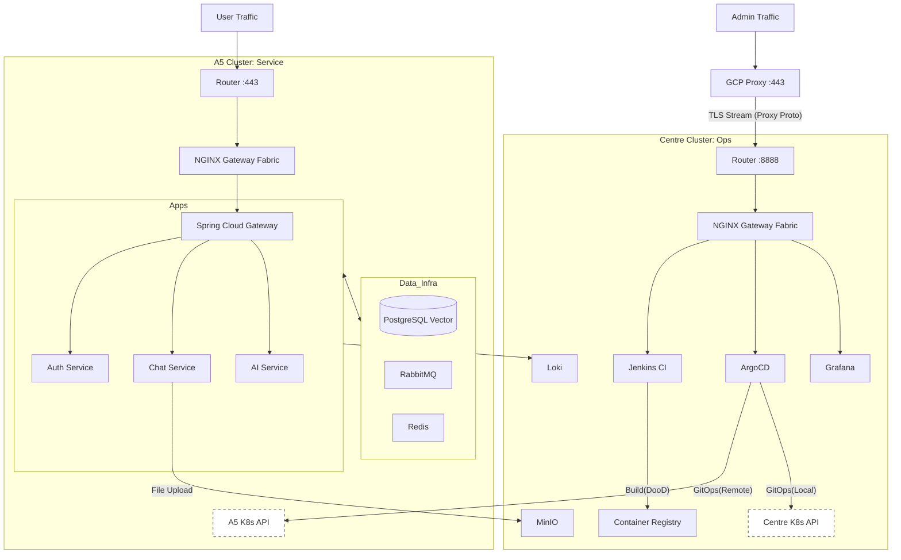

# k8s Configuration repository for Protostar---

## 개요

  - 2025.09 최초 기획 이후 V2 아키텍처를 수립하고 기술 검증을 진행하던 중, 온프레미스 환경의 리소스 경합 및 네트워크 제약 사항을 확인하였다. 이에 기존 V2의 소프트웨어적 목표(Spring, MSA, AI)는 유지하되, 인프라의 안정성을 확보하기 위해 아키텍처를 **V2.1**로 고도화한다.
  - 기본적인 Protostar의 AI와 RAG 기반 HR 서비스 방향성은 동일하다.
  - **V2.1의 핵심 변경 포인트 (인프라 최적화):**
      - **물리적 격리 (Physical Isolation):** 관리 도구(CI/CD, Monitoring)와 실행 환경(Service, DB)을 물리적으로 완벽히 분리하여 상호 간섭을 제거한다. (A5 vs Centre)
      - **관제 우선 전략 (Control First):** 배포 및 관제를 담당하는 Centre 서버를 선행 구축하여 안정적인 운영 기반을 먼저 확보한다.
      - **네트워크 이원화 (Dual Path):** 서비스망(Direct)과 관리망(GCP Bypass)을 분리하여 단일 IP 포트 한계를 극복하고 보안을 강화한다.
      - **최신 표준 도입:** 1. **Gateway API:** Ingress 대신 차세대 표준인 NGINX Gateway Fabric 도입.
        2\. **GitOps 고도화:** 독립된 두 클러스터를 ArgoCD 하나로 통합 제어.
        3\. **보안 강화:** Sealed Secrets를 도입하여 GitOps 보안 구멍(Secret 관리) 해결.

## 성공 지표 (KPI)

1.  **인프라의 완전한 격리 및 안정성 확보:** 관리 도구(Jenkins 등)의 부하가 서비스에 영향을 주지 않는 물리적 아키텍처 구축.
2.  **GitOps 기반의 무중단 배포 및 멀티 클러스터 관리:** ArgoCD 하나로 Local(Centre)과 Remote(A5) 클러스터를 통합 제어.
3.  **Gateway API 표준 구현:** NGINX Gateway Fabric을 활용한 L4/L7 트래픽 제어 및 인증서 자동화(cert-manager).
4.  **기존 백엔드 기술의 심도 있는 진행:** NestJS(디자인 패턴), Spring WebFlux(비동기 논블로킹)의 실무적 구현.
5.  **AI/RAG 파이프라인 최적화:** FastAPI와 RabbitMQ를 활용한 비동기 임베딩 처리 및 데이터 파이프라인 구축.
6.  **보안 운영 자동화:** Sealed Secrets 및 GCP TLS Passthrough를 통한 보안 터널링 구현.

## 개발환경

1.  Windows WSL2 기반 개발 컴퓨터
2.  M4 맥북 프로 24GB 메모리 개발 컴퓨터
3.  **GEEKOM A5 MiniPC : 7/24 구동, Production Server (Main)**
    1.  CPU: R5-7430U (8C 16T)
    2.  RAM: DDR4 32GB
    3.  Storage: 1TB Sata SSD
    4.  OS: Ubuntu + **MicroK8s (Cluster A)**
    5.  **핵심 역할:** 실제 서비스 구동 및 데이터 처리 (High Performance)
    6.  서버 내부 구성 (Planned)
          - NGINX Gateway Fabric (Gateway API)
          - Application Pods (Spring, NestJS, FastAPI)
          - **PostgreSQL (+pgvector)**
          - **RabbitMQ**
          - **Redis**
          - Agent: Promtail, cAdvisor, Node-exporter
4.  **ThinkCentre MiniPC : 7/24 구동, Management Server (Sub)**
    1.  CPU: Ryzen 5 Pro 3400GE (4C 8T)
    2.  RAM: DDR4 16GB
    3.  OS: Ubuntu + **MicroK8s (Cluster B)**
    4.  **핵심 역할:** 배포, 모니터링, 외부 우회 접속 허브 (Stability)
    5.  서버 내부 구성 (Planned)
          - NGINX Gateway Fabric (Admin Entry)
          - **Jenkins (DooD Build)**
          - **ArgoCD (Control Plane)**
          - **Loki / Prometheus / Grafana**
          - **MinIO**
5.  **GCP 서버 : 7/24 미국 GCP 무료티어** 1. 역할: Management Network Entry Point
    2\. 구성: Nginx (Stream Module)
    3\. **선택 근거 (변경됨):**
    \- **TLS Passthrough:** HTTPS 암호화를 풀지 않고 패킷을 그대로 Centre 서버로 전달하여 인증서 관리 단순화.
    \- **PROXY Protocol:** Centre 서버가 원본 접속자 IP를 식별할 수 있도록 프로토콜 헤더 동기화 지원.

## 데이터 저장 전략

### 전략 변경 핵심: Data Locality (데이터 지역성)

이전 기획에서는 DB 분리를 고려했으나, V2.1에서는 RAG 및 고속 트랜잭션 처리를 위해 **DB와 MQ는 서비스가 실행되는 A5 서버에 위치**시켜 성능을 극대화한다. 반면, 리소스를 많이 차지하는 정적 파일(MinIO)과 로그(Loki)는 Centre로 분리한다.

### 확정 전략

| 저장소 | 역할 | 저장 데이터 | 위치 | 비고 |
| :--- | :--- | :--- | :--- | :--- |
| **PostgreSQL** | 서비스/AI 통합 DB | 유저 정보, 대화 이력, **Vector 임베딩(pgvector)** | **A5** | 트랜잭션 보장 및 지연 최소화 |
| **RabbitMQ** | 비동기 메시지 브로커 | RAG 작업 큐, 로그 이벤트, 알림 큐 | **A5** | 서비스 간 결합도 분리 |
| **Redis** | 인메모리 캐시 | 일일 질문 제한(Rate Limit), 세션 캐싱 | **A5** | 고속 접근 필요 |
| **MinIO** | Object Storage | PDF/이미지 원본, 정적 자산 백업 | **Centre** | 대용량 파일 저장, 빌드 부산물 |
| **Loki** | 로그 저장소 | 전체 서버의 로그 영구 보관 및 인덱싱 | **Centre** | A5 부하 분리 |

## MSA 서버 구성

| 서버명 | 주요 역할 | 내장 서비스 | 배포 위치 |
| :--- | :--- | :--- | :--- |
| **Auth 서버** | 인증/인가, JWT 토큰 관리 | Spring WebFlux + R2DBC | A5 |
| **User 서버** | 사용자 프로필 및 권한 관리 | Spring WebFlux | A5 |
| **Chat 서버** | 대화 및 커리어 데이터 관리 | NestJS (Main Logic) | A5 |
| **AI 서버** | LLM 호출 및 RAG 처리 | FastAPI (Python) | A5 |
| **Noti 서버** | 알림 발송 (Discord/Email) | RabbitMQ Consumer | A5 |
| **Gateway** | L7 애플리케이션 라우팅 | **Spring Cloud Gateway** | A5 |
| **Logging** | 로그 수집 및 시각화 | Loki + Grafana | **Centre** |
| **CI/CD** | 빌드 및 배포 통제 | Jenkins + ArgoCD | **Centre** |

### 서버별 책임 및 설계 결정 (V2.1 업데이트)

#### API Gateway 계층 (Dual Gateway)

  - **L4/L7 인프라 게이트웨이 (NGINX Gateway Fabric):** - K8s 클러스터의 '정문'. SSL Termination(cert-manager 연동) 및 트래픽 진입 담당.
  - **L7 애플리케이션 게이트웨이 (Spring Cloud Gateway):**
      - '안내 데스크'. 비즈니스 로직 기반 라우팅, 인증 필터링, Rate Limiting 수행.
      - **Identity Propagation:** 인증 후 `X-User-Id` 헤더를 통해 내부 MSA 서비스에 유저 정보 전달 규약 준수.

#### AI 서버 & RabbitMQ

  - **비동기 RAG 파이프라인:** - Chat 서버(NestJS)는 사용자의 파일을 받고 즉시 응답(200 OK).
      - 백그라운드에서 RabbitMQ로 메시지 발행 -\> AI 서버(FastAPI)가 구독하여 임베딩 및 Vector DB 적재 수행.
      - 이를 통해 사용자는 AI 처리 시간 동안 대기하지 않음.

## MSA 아키텍쳐 및 통신 방법 (V2.1 Network Strategy)

### 1\. 네트워크 이원화 전략 (Dual Path)

단일 공인 IP의 한계를 극복하고 보안을 강화하기 위해 트래픽 성격에 따라 경로를 물리적으로 분리한다.

  - **Path A: Service Path (Direct)**
      - **경로:** User -\> Router(443) -\> **A5 Server** (NGF)
      - **특징:** GCP를 거치지 않는 직결 경로. 지연 시간 최소화. 서비스 트래픽 전용.
  - **Path B: Management Path (Bypass)**
      - **경로:** Admin -\> GCP(443) -\> Router(8888) -\> **Centre Server** (NGF)
      - **특징:** 포트 포워딩 한계를 극복하기 위한 우회 경로.
      - **기술:** **TLS Passthrough** (GCP는 패킷만 전달) + **PROXY Protocol** (원본 IP 보존).

### 2\. 내부 통신 전략

  - **Synchronous (HTTP):** Spring Gateway -\> Auth/User/Chat (즉시 응답 필요 시).
  - **Asynchronous (RabbitMQ):** Chat -\> AI (RAG 처리), Any -\> Logging (로그 전송).



### k8s 관리 및 GitOps 확정사항 (V2.1)

#### 1\. Kubernetes 배포판: MicroK8s (Independent)

  - A5와 Centre에 각각 **독립된 클러스터**를 구축한다.
  - `microk8s join`을 사용하지 않음으로써, 한쪽 서버의 장애가 다른 쪽에 전파되는 것을 원천 차단한다.

#### 2\. Gateway 전략: Gateway API + NGINX Gateway Fabric

  - **표준 준수:** Deprecated 예정인 Ingress 대신 Gateway API CRD를 사용한다.
  - **cert-manager 연동:** Gateway 리소스와 연동하여 Let's Encrypt 인증서를 자동 발급/갱신한다.

#### 3\. 레포지토리 전략: 1 Config + N Apps

  - **App Repos (Polyrepo):** 서비스별 소스 코드 저장소 (`project-protostar-chat` 등).
  - **Config Repo (Monorepo):** `project-protostar-k8s-config`.
      - 디렉토리 기반 격리 전략 사용:
          - `/overlays/a5-main`: A5 클러스터 배포용 Manifest.
          - `/overlays/centre-sub`: Centre 클러스터 배포용 Manifest.

#### 4\. 환경변수 및 보안: Sealed Secrets

  - **문제 해결:** Git에 비밀번호를 올릴 수 없는 문제.
  - **해결책:** **Bitnami Sealed Secrets** 도입.
      - 로컬에서 암호화된 `sealed-secret.yaml`을 Git에 업로드.
      - 클러스터 내부의 Controller만이 복호화 가능.
      - **주의:** A5와 Centre는 서로 다른 암호화 키를 가지므로 보안 격리됨.

#### 5\. CI/CD 워크플로우 (DooD)

  - **Jenkins (Centre):**
      - **DooD (Docker-outside-of-Docker):** 호스트의 Docker 소켓을 공유하여 빌드 캐시 활용 및 메모리 절약.
      - **리소스 제한:** 16GB 램 보호를 위해 동시 빌드(Executor) 개수를 1\~2개로 제한.
  - **ArgoCD (Centre):**
      - **Multi-Cluster Management:** - App 1: Local Cluster (Centre) 배포.
          - App 2: Remote Cluster (A5) 배포 (Kubeconfig 등록).


-----

## 주요 기술적 우려 사항 및 대응 전략 (Risk Management)

본 아키텍처 구현 시 발생할 수 있는 주요 리스크와 이에 대한 기술적 방어 전략을 정의한다.

### 1\. 개발 및 구현 단계 (Code Level)

#### 1.1. 인증 정보 전달 (Identity Propagation)

  - **우려:** Spring Gateway에서 인증을 마친 후, 뒤단에 있는 NestJS나 FastAPI는 "요청자가 누구인지" 알 수 없는 상태가 된다. 각 서비스마다 JWT 검증 로직을 중복 구현하는 것은 비효율적이다.
  - **대응 전략: Token Relay & Custom Header**
      - **Gateway:** JWT 검증 성공 시, 페이로드에서 `sub`(User ID), `email`, `role`을 추출한다.
      - **Header Injection:** 추출한 정보를 `X-User-Id`, `X-User-Email`, `X-User-Role` 헤더에 담아 내부 서비스로 전달한다.
      - **Internal Trust:** 내부 서비스(NestJS, FastAPI)는 별도의 토큰 검증 없이 이 **헤더 값만 신뢰**하여 비즈니스 로직을 수행한다.
      - **보안 전제:** K8s NetworkPolicy를 통해 내부 서비스는 오직 Gateway로부터의 트래픽만 허용해야 한다 (외부 직접 접속 차단).

#### 1.2. 폴리글랏 통신 규약 파편화 (Protocol Fragmentation)

  - **우려:** Java(Spring), TS(NestJS), Python(FastAPI) 프레임워크가 기본적으로 반환하는 에러 및 응답 JSON 구조가 서로 다르다. (예: Spring의 `timestamp` vs FastAPI의 `detail`). 프론트엔드(Next.js)에서의 예외 처리가 복잡해진다.
  - **대응 전략: Envelope Pattern (공통 응답 껍데기)**
      - 모든 백엔드 서비스는 언어와 상관없이 아래의 공통 JSON 포맷을 준수하도록 `Interceptor`나 `Filter`를 구현해야 한다.
    ```json
     {
       "resultCode": "SUCCESS", // 또는 "ERROR_CODE"
       "data": { ... },         // 실제 데이터
       "message": "요청이 성공했습니다." // 사용자 표시 메시지
     }
    ```

### 2\. 운영 및 인프라 단계 (Ops Level)

#### 2.1. 빌드 리소스 고갈 (Resource Starvation)

  - **우려:** Centre 서버(16GB RAM)에서 Jenkins가 Spring(Gradle)이나 Next.js(Webpack) 빌드를 동시에 수행할 경우, 메모리 부족(OOM)으로 ArgoCD나 Monitoring 시스템이 함께 중단될 위험이 있다.
  - **대응 전략: 동시성 제한 및 DooD**
      - **Concurrency Limit:** Jenkins의 동시 실행 빌드 수(Executors)를 **최대 1\~2개**로 강제 제한하여 순차적으로 처리한다.
      - **DooD 캐싱:** 호스트의 Docker 데몬을 공유하여, `npm install`이나 `gradle` 캐시를 재사용함으로써 빌드 시간과 자원 소모를 줄인다.

#### 2.2. Next.js 캐시 휘발성 (Ephemeral Cache)

  - **우려:** K8s 파드(Pod)는 수시로 재생성된다. Next.js의 ISR(Incremental Static Regeneration) 페이지나 최적화된 이미지는 기본적으로 파드 내부 파일 시스템에 저장되므로, 파드 재생성 시 캐시가 유실되어 초기 로딩 속도 저하가 발생할 수 있다.
  - **대응 전략:**
      - **Phase 1 (수용):** 초기 단계에서는 파드 재생성 시 캐시 초기화를 감수하고 SSR 위주로 운영한다.
      - **Phase 2 (개선):** 향후 `redis-cache-adapter` 등을 적용하여 Next.js의 캐시 저장소를 파드 내부가 아닌 A5 서버의 **Redis**로 외부화한다.

#### 2.3. GCP 우회 접속 시 IP 유실 및 호환성

  - **우려:** GCP를 통해 우회 접속 시, TLS Passthrough를 사용하더라도 패킷 헤더에 GCP의 IP가 찍혀 원본 사용자 식별 및 IP 차단이 불가능하다. 또한 `npmplus` 등 GUI 툴 사용 시 프로토콜 호환성 문제가 발생한다.
  - **대응 전략: PROXY Protocol & NGINX Gateway Fabric**
      - **GCP Nginx:** `stream` 블록에서 `proxy_protocol on;` 설정을 통해 원본 IP 헤더를 패킷에 부착하여 전송한다.
      - **Centre NGF:** `NginxProxy` CRD 설정을 통해 PROXY Protocol 수신을 활성화하고, 신뢰할 수 있는 IP 대역(GCP 대역)을 명시하여 호환성 문제를 코드로 제어한다.

## 부록: 소프트웨어 상세 및 구현 목표 (V2 발췌)

V2.1 아키텍처 위에서 구동될 실제 애플리케이션의 세부 로직과 개발 방법론에 대한 보강 내용이다.

### 1. 서비스별 상세 비즈니스 로직

인프라 구성도에는 포함되었으나, 구체적인 내부 구현 로직은 다음을 따른다.

* **User 서버 (권한 및 역할 체계)**
    * **통합 논리:** 별지기(관리자급)와 샛별(유저)은 완전히 다른 도메인이 아니며, 하나의 계정이 두 역할을 동시에 보유할 수 있다. (샛별 = 별지기 + 샛별 기능)
    * **성장형 권한 체계 구현:**
        * `Guest`: 비로그인
        * `Stargazer`: 회원가입 완료 (질문 3회 제한)
        * `Protostar`: 초대코드 입력 완료 (질문 10회/일, 모든 기능 해금)
* **Chat 서버 (통계 및 데이터)**
    * **데이터 모듈화:** 초기에는 Content(커리어 자료)와 Chat(대화)이 밀접하므로 하나의 서버에 두되, 향후 `ActiveStatics`(활동 통계) 서비스로 분리 가능하도록 모듈 구조로 설계한다.
* **AI 서버 (모델 전략)**
    * **비용 최적화:** 로컬 추론 부하 방지를 위해 Gemini API를 메인으로 사용한다.
    * **추상화:** 향후 Claude 등 타 모델 전환이 용이하도록 LLM 호출부를 추상화 계층(Interface)으로 구현한다.

### 2. 프론트엔드 및 선행 미니 프로젝트

메인 프로젝트(HR 챗봇) 전, 기술 검증과 흥미 유발을 위한 선행 프로젝트를 수행한다.

* **프론트엔드 구성 요소:**
    1.  **기술 블로그 챗봇 컴포넌트:** 정적 블로그에 이식 가능한 경량화 버전.
    2.  **메인 서비스 (SPA/SSR):** Next.js 기반의 채팅 UI 및 대시보드.
    3.  **어드민 대시보드:** RAG 데이터 관리 및 프롬프트 제어용.
* **선행 미니 프로젝트: 'AI 심리 테스트'**
    * **목표:** 챗봇 UX 구현 연습 및 AI 에셋 활용 능력 배양.
    * **콘텐츠:** Big-Five 이론 기반에 판타지/SF 네러티브를 입힌 스토리텔링형 테스트.
    * **기술 전략:** `gpt-oss-120b` 등 가성비 모델을 활용하여 API 비용 최소화.
    * **기능:** 간단 회원가입(이메일)을 통해 유저 기록 저장 및 결과 공유 기능 구현.

### 3. 개발 방법론 및 도구 활용

단순 구현을 넘어 개발 효율성과 품질을 높이기 위한 전략을 포함한다.

* **AI 기반 개발 체계화:**
    * Gemini (기획 및 로직 설계)
    * Code Rabbit AI (코드 리뷰 및 리팩토링 제안)
* **심층 개선 프로세스 (Iterative Improvement):**
    * 기능 구현 후 즉시 넘어가지 않고, **반드시 1회 이상의 문서화 및 심층 분석**을 수행한다.
    * 분석 결과 중 **'딱 1개'의 핵심 개선점**을 도출하여 수정하고, 그 결과를 다시 테스트하는 과정을 거친다.

### 4. 추가 성공 지표 (Soft Skill KPI)

인프라 안정성 외에 개인의 역량 성장을 위한 지표를 유지한다.

1.  **풀스택 역량 확보:** Next.js 및 React 생태계의 능숙한 활용.
2.  **적응력 증명:** 국내 시장 수요가 높은 Spring 프레임워크(WebFlux)를 실제 프로젝트에 녹여내어, Node.js 개발자로서의 유연함과 학습 능력을 포트폴리오로 증명한다.
3.  **디자인 패턴 내재화:** NestJS 구현 시 서비스 특성에 맞는 디자인 패턴을 적용하고, '왜 이 패턴을 썼는지'에 대한 주석과 문서를 남긴다.